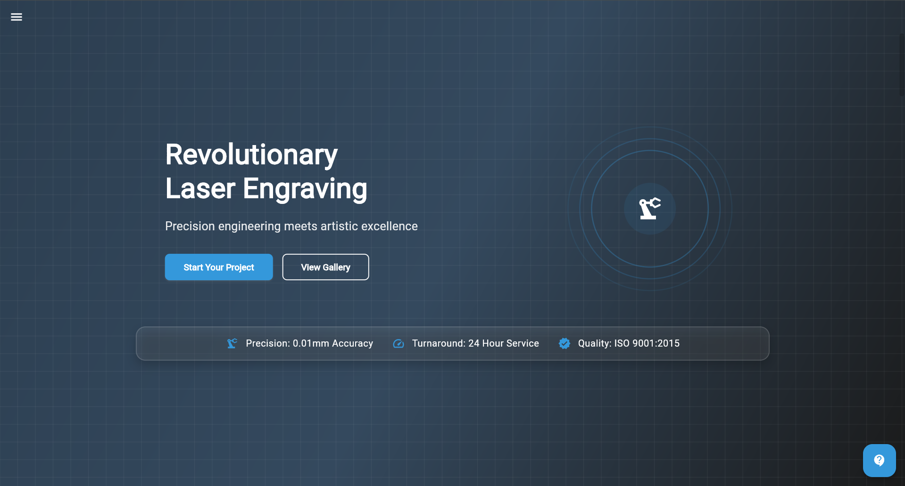

# Laser Engraving 

A professional, responsive Flutter web application built for a laser engraving company, featuring elegant UI, smooth animations, and comprehensive business information.

## 🔗 Live Demo
[View live demo](https://laser-engraving.netlify.app/) 



## Overview

This project is a comprehensive, modern website for a laser engraving business that showcases their services, portfolio, and contact information. The website features a responsive design that adapts seamlessly to different screen sizes and devices.

## ✨ Features

- **Fully Responsive Design**: Optimized for desktop, tablet, and mobile viewing experiences
- **Animated UI**: Smooth transitions and animations enhance user experience
- **Navigation**: Intuitive navigation with drawer menu for mobile devices
- **Sections**:
  - Home Page with hero section, features, project showcase, testimonials, and CTA
  - Gallery with filterable projects
  - About Us with company vision, team members, process, and technology
  - Contact Page with form submission and company information
- **Interactive Elements**:
  - Floating contact button
  - Hoverable cards
  - Category filters
  - Form validation

## 🛠️ Technologies Used

- **Flutter**: Cross-platform UI toolkit
- **Dart**: Programming language
- **Material Design**: UI components following Material design guidelines
- **Custom Animations**: Created with Flutter's animation controllers

## 📁 Project Structure

```
lib/
├── config/              # App-wide configuration settings
├── models/              # Data models
├── screens/             # Main application screens
│   ├── home/            # Home screen and related sections
│   ├── about/           # About screen and related sections
│   ├── gallery/         # Gallery screen and components
│   ├── contact/         # Contact screen and form
├── services/            # Service classes (e.g. EmailService)
├── utils/               # Utility classes
│   ├── colors.dart      # App color schemes
│   ├── screen_utils.dart # Responsive helpers
├── widgets/             # Reusable UI components
```


## Getting Started

### 🚀 Prerequisites

- Flutter SDK (version 3.0.0 or later)
- Dart SDK (version 2.17.0 or later)
- Any IDE with Flutter support (VS Code, Android Studio, etc.)

### Installation

1. Clone the repository:
   ```bash
   git clone https://github.com/anicabarrios/laser_engrave.git
   ```

2. Navigate to the project directory:
   ```bash
   cd laser_engrave
   ```

3. Get dependencies:
   ```bash
   flutter pub get
   ```

4. Run the application:
   ```bash
   flutter run -d chrome

   ```
## 📲 Building for Deployment

```
 # Build the web app in release mode

    flutter build web --release

 # Output will be generated in the build/web directory
```

## 🌐 Deployment

This project is deployed on Netlify. To deploy your own version:

1. Build the project as shown above 
2. Create a new site on Netlify
3. Upload the contents of the build/web directory or connect your GitHub repository
4. Configure your deployment settings
5. Deploy!

## ⚙️ Configuration
To configure the contact form's EmailJS integration:

1. Create an account on EmailJS
2. Create a service and template
3. Update the configuration in lib/services/email_service.dart

## 🤝 Contributing

Contributions, issues, and feature requests are welcome!

## 📄 License

This project is licensed under the MIT License - see the LICENSE file for details.